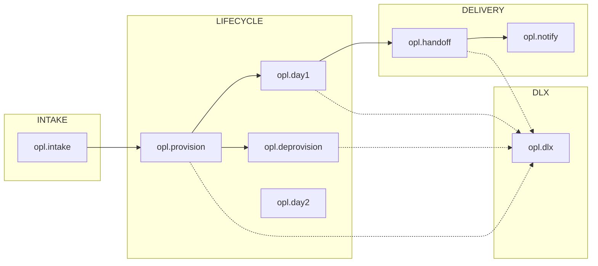

# OpenShift Partner Labs - Messaging System

Event-driven messaging infrastructure for the OpenShift Partner Labs provisioning workflow.

## Overview

This system uses a message-broker with topic exchanges to orchestrate cluster provisioning, day-one configuration, and handoff workflows. State is captured in message flow rather than database polling — queue position indicates workflow progress.

**Key characteristics:**
- 8 topic exchanges organized by domain (intake, provision, deprovision, day1, day2, handoff, notify, dlx)
- 68 quorum queues with automatic leader election
- Per-component least-privilege permissions
- TTL tiering: 24h (status), 72h (tasks), 7d (human-gated)
- Dead-letter routing with per-domain DLQs

## Quick Start

### Prerequisites

- OpenShift cluster with RabbitMQ Cluster Operator installed
- RabbitMQ Messaging Topology Operator installed
- `oc` CLI configured for target cluster

### Deploy with Kustomize

```bash
# Staging (queue-dev cluster in staging namespace)
oc apply -k kustomize/overlays/staging

# Production (queue cluster in queue namespace)
oc apply -k kustomize/overlays/prod
```

Or apply directly:

```bash
oc apply -f rabbitmq-cluster.yaml
oc apply -f rabbitmq-vhost.yaml
oc apply -f rabbitmq-topology-manifests.yaml
oc apply -f rabbitmq-users-permissions.yaml
```

## Architecture



### Components

| Component | Role |
|-----------|------|
| workflow-engine | Ingress — validates source, publishes raw intake |
| worker-etl | Transforms raw payloads to canonical schema |
| scribe | Saga orchestrator — persists state, coordinates workflows |
| messenger | Team-chat bot — handles dispatch buttons, slash commands |
| worker-provisioning | Generates manifests, opens PRs |
| provision-watcher | CronJob polling cluster status |
| worker-day-one | Job orchestrator for day-one tasks (OAuth, SSL, RBAC) |
| worker-credentials | Creates secure-paste entries |
| worker-notification | Sends emails and alerts |

## Queue Summary

| Domain | Exchange | Queue Count | Purpose |
|--------|----------|-------------|---------|
| Intake | `opl.intake` | 9 | Raw intake, normalization, dispatch |
| Provision | `opl.provision` | 12 | Manifest generation, PR lifecycle, cluster status |
| Deprovision | `opl.deprovision` | 6 | Archive, PR merge, cluster removal |
| Day-One | `opl.day1` | 20 | OAuth, SSL, kubeadmin, RBAC tasks |
| Day-Two | `opl.day2` | 6 | Generic day-two operations |
| Handoff | `opl.handoff` | 10 | Credentials, welcome email |
| Notify | `opl.notify` | 7 | User/admin notifications |
| Dead-Letter | `opl.dlx` | 8 | Failed messages by domain |

## Operations

### Monitoring

Key metrics to watch:

| Metric | Meaning | Alert Threshold |
|--------|---------|-----------------|
| Queue depth | Work backlog | >100 sustained |
| DLQ depth | Failed messages | >0 |
| Consumer count | Processing capacity | 0 (no consumers) |
| Message age | Time in current state | >TTL tier |

### Troubleshooting

**Messages in DLQ:**
```bash
# List DLQ depths (exec into RabbitMQ pod)
oc exec -it rabbitmq-0 -- rabbitmqctl list_queues name messages --vhost opl | grep dlq
```

**Replay a DLQ message:**
1. Inspect message in management UI
2. Fix root cause
3. Use shovel or manual republish to source exchange

**Stuck workflow:**
1. Find `correlation_id` from logs
2. Query queue positions: `oc exec -it rabbitmq-0 -- rabbitmqctl list_queues name messages --vhost opl`
3. Check DLQs for related failures

## Development

### Adding a New Queue

1. Add queue definition to `rabbitmq-topology-manifests.yaml`
2. Add binding to appropriate exchange
3. Update component permissions in `rabbitmq-users-permissions.yaml`
4. Document in `REFERENCE.md`

### Message Schema

All messages follow the envelope pattern:

```json
{
  "event_type": "lab.day1.ssl.create",
  "event_id": "uuid",
  "timestamp": "ISO8601",
  "source": "scribe",
  "correlation_id": "uuid",
  "version": "1.0.0",
  "payload": { }
}
```

See [REFERENCE.md](REFERENCE.md) for complete schemas.

## Documentation

| Document | Purpose |
|----------|---------|
| [REFERENCE.md](REFERENCE.md) | Queue names, message schemas, component inventory |
| [docs/exchange-model.md](docs/exchange-model.md) | Exchange routing, binding conventions, permissions |
| [docs/state-via-queues.md](docs/state-via-queues.md) | Event-sourcing pattern, state capture model |

## File Structure

```
.
├── README.md                          # This file
├── REFERENCE.md                       # Complete reference documentation
├── rabbitmq-cluster.yaml             # RabbitmqCluster CR (the broker instance)
├── rabbitmq-vhost.yaml               # Virtual host definition
├── rabbitmq-topology-manifests.yaml  # Queues, exchanges, bindings, policies
├── rabbitmq-users-permissions.yaml   # Per-component users and permissions
├── docs/
│   ├── exchange-model.md             # Routing and binding details
│   └── state-via-queues.md           # State capture pattern
└── kustomize/
    ├── base/                         # Base manifests
    └── overlays/
        ├── staging/                  # Staging: queue-dev cluster in staging namespace
        └── prod/                     # Production: queue cluster in queue namespace
```
