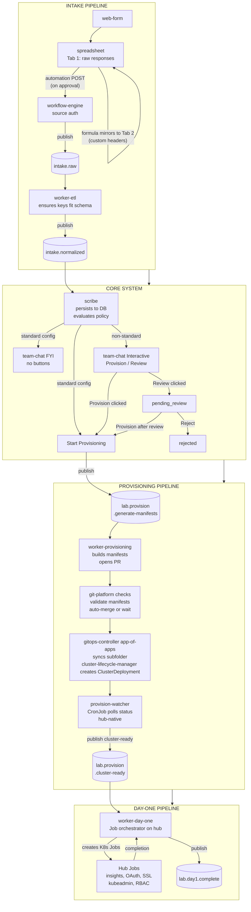
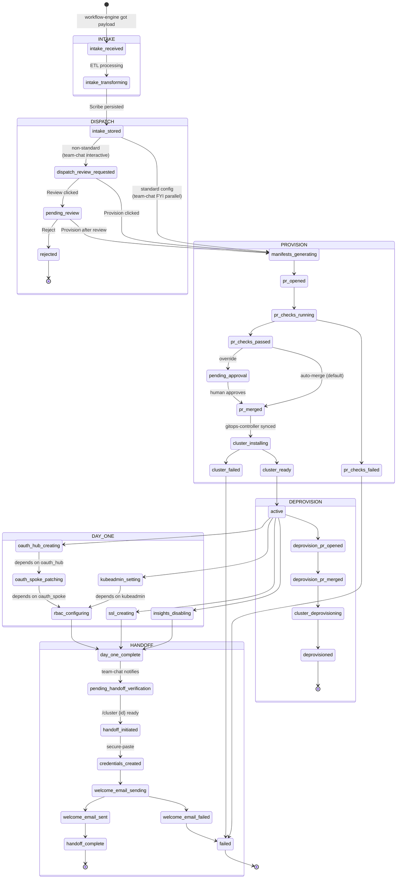
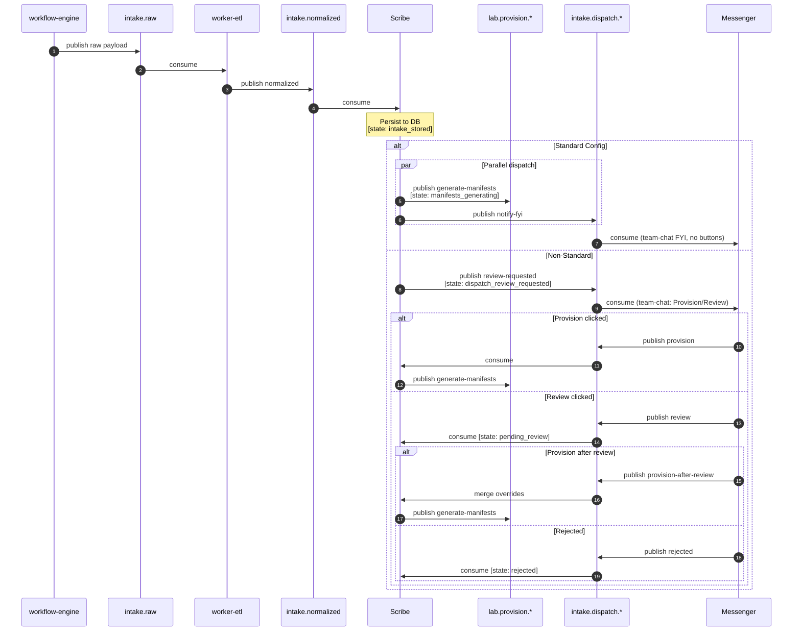
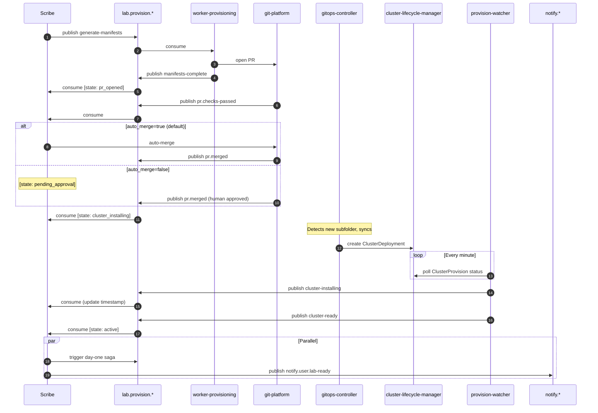
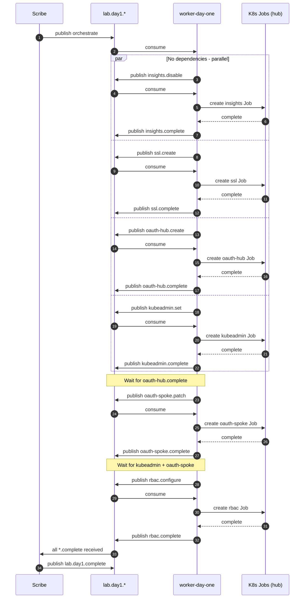
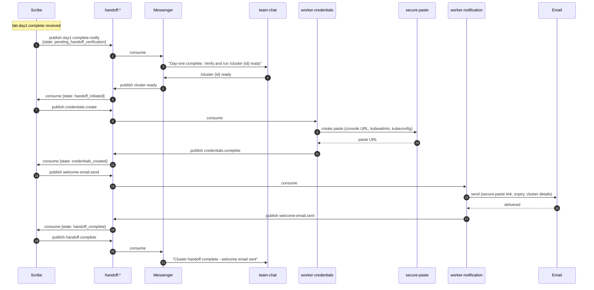
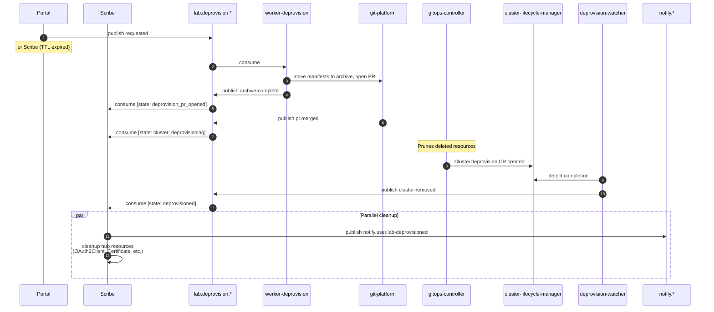

# OpenShift Partner Labs — Queue Names & Message Schemas (v3)

> Living reference for all queue (topic/routing key) names and their message schemas.
> Belongs in `commons/` as the single source of truth consumed by all components.

---

## What Changed from v2

| Change | Why |
|--------|-----|
| Intake pipeline: web-form → spreadsheet Tab 2 (custom headers) → spreadsheet-automation → workflow-engine → ETL | Portal is read-only status/management, not the submission mechanism |
| **message-broker** confirmed | Broker decision resolved |
| **workflow-engine** (self-hosted on hub cluster) as source-validated HTTP ingress | Trust boundary between spreadsheet-automation and the broker |
| team-chat always notified: FYI (no buttons) for standard, Provision/Review for non-standard | Every request visible in team-chat; auto-provision starts immediately in parallel |
| PR **auto-merges by default** after checks pass | Human gate is at Slack dispatch, not the PR. PR gate is the exception. |
| **Provision-watcher**: standalone CronJob on hub, polls for ClusterProvision ready state | Eliminates external credential gathering — runs hub-native with SA permissions |
| **Deprovision-watcher**: gitops-controller-managed Job (part of app-of-apps), watches ClusterDeprovision | Already confirmed working |
| **worker-day-one** redefined as a **Job orchestrator** on the hub cluster | Reads queue, creates/triggers K8s Jobs on hub. Jobs run hub-native — no external kubeconfig needed. |
| Added `lab.day1.insights.disable` | Insights operator needs to be disabled as a day-one task |
| **Handoff pipeline** after day-one: team-chat notification → human verification → `/cluster {id} ready` → secure-paste → welcome email | Cluster isn't "delivered" until credentials are securely shared via secure-paste and welcome email is sent |
| New components: **worker-credentials** (creates secure-paste) and welcome email generation via **worker-notification** | Chain: credentials worker creates paste URL → passes to email worker for welcome email |
| New state: `handoff_complete` | Final terminal state for a successfully delivered cluster |
| Messenger bot handles `/cluster {id} ready` slash command directly | Consistent with messenger owning all team-chat interactions |

---

## Architecture: Component Map



### Component Inventory

| Component | Type | Runs On | Description |
|-----------|------|---------|-------------|
| **workflow-engine** | Self-hosted workflow automation | Hub cluster | Receives spreadsheet-automation POST, validates source is trusted, publishes raw payload to message-broker. Zero transformation. |
| **worker-etl** | message-broker consumer | Hub cluster | Transforms raw Tab 2 JSON (custom headers) into canonical schema. Ensures keys fit what Scribe expects. |
| **scribe** | Saga orchestrator | Hub cluster | Persists to DB, evaluates auto-provision policy, orchestrates all downstream workflows. Single writer. |
| **messenger** | team-chat bot | Hub cluster | Posts FYI messages (standard) or interactive Provision/Review messages (non-standard). Handles `/cluster {id} ready` slash command. Publishes dispatch and handoff decisions back to message-broker. |
| **worker-provisioning** | message-broker consumer | Hub cluster | Builds cluster-lifecycle-manager/gitops-controller manifests from message data, opens PR in gitops repo. |
| **worker-deprovision** | message-broker consumer | Hub cluster | Moves cluster manifests to archive directory, opens PR. |
| **provision-watcher** | Standalone CronJob | Hub cluster | Polls every minute for cluster-lifecycle-manager ClusterProvision status. Publishes `cluster-ready` or `cluster-failed` to message-broker. Runs hub-native with SA permissions — no external credential gathering. |
| **deprovision-watcher** | gitops-controller-managed Job | Hub cluster | Part of app-of-apps setup. Watches for ClusterDeprovision job completion, does cleanup. Publishes `cluster-removed` to message-broker. Confirmed working. |
| **worker-day-one** | Job orchestrator (message-broker consumer) | Hub cluster | Reads day-one sub-task messages from message-broker. Creates/triggers K8s Jobs on the hub cluster for each task. Jobs execute with hub SA permissions — no external kubeconfig needed. Watches Job completion, reports status back to message-broker. |
| **worker-day-two** | message-broker consumer | Hub cluster | Day-two operations. Same Job orchestrator pattern as worker-day-one. |
| **worker-credentials** | message-broker consumer | Hub cluster | Creates password-protected secure-paste entries containing cluster credentials (console URL, kubeadmin password, kubeconfig). Publishes paste URL to queue for email worker. Hub-native — reads credentials from hub secrets. |
| **worker-notification** | message-broker consumer | Hub cluster | Email and basic alerts. Generates and sends welcome emails (with secure-paste link) and lifecycle notifications. |
| **portal** | Web app (read-only DB) | Hub cluster | Status dashboard, lab management UI. Does NOT handle request intake. |

> **Why hub-native execution matters:** The provision-watcher, deprovision-watcher, and day-one Jobs all run on the hub cluster with service account permissions. This eliminates the need to gather kubeconfigs, manage external credentials, or reach into clusters from outside. The hub SA already has access to cluster-lifecycle-manager CRs, spoke cluster secrets, and certificate-manager resources.

---

## Lab State Machine



---
## [Exchange Model](docs/exchange-model.md)

## Queue / Topic Names

### Intake Pipeline

| Queue Name                              | Publisher      | Consumer(s)  | Purpose |
|-----------------------------------------|----------------|--------------|---------|
| `intake.raw`                            | workflow-engine | worker-etl   | Raw Tab 2 JSON from spreadsheet-automation — custom headers, no transformation |
| `intake.raw.failed`                     | worker-etl     | scribe       | ETL transformation failed |
| `intake.normalized`                     | worker-etl     | scribe       | Transformed payload matching canonical schema |

### Dispatch

| Queue Name                              | Publisher      | Consumer(s)  | Purpose |
|-----------------------------------------|----------------|--------------|---------|
| `intake.dispatch.notify-fyi`            | scribe         | messenger    | Standard config — team-chat FYI, no buttons, fire-and-forget |
| `intake.dispatch.review-requested`      | scribe         | messenger    | Non-standard — team-chat interactive with Provision/Review buttons |
| `intake.dispatch.provision`             | messenger      | scribe       | team-chat: Provision button clicked |
| `intake.dispatch.review`                | messenger      | scribe       | team-chat: Review button clicked |
| `intake.dispatch.provision-after-review`| messenger      | scribe       | team-chat: Provision after prior Review |
| `intake.dispatch.rejected`              | messenger      | scribe       | team-chat: Request rejected during review |

### Provisioning

| Queue Name                              | Publisher            | Consumer(s) | Purpose |
|-----------------------------------------|----------------------|-------------|---------|
| `lab.provision.generate-manifests`      | scribe               | worker-prov | Build manifests and open PR |
| `lab.provision.manifests-complete`      | worker-prov          | scribe      | Manifests generated, PR opened |
| `lab.provision.pr.checks-running`       | worker-prov / CI     | scribe      | PR checks started |
| `lab.provision.pr.checks-passed`        | CI webhook / prov    | scribe      | All PR checks passed |
| `lab.provision.pr.checks-failed`        | CI webhook / prov    | scribe      | PR checks failed |
| `lab.provision.pr.approval-required`    | scribe               | notif       | PR override: needs human approval (non-default) |
| `lab.provision.pr.merged`               | git-platform webhook / prov | scribe | PR merged (auto or manual) |
| `lab.provision.cluster-installing`      | provision-watcher    | scribe      | cluster-lifecycle-manager began cluster installation |
| `lab.provision.cluster-ready`           | provision-watcher    | scribe      | Cluster ready, all default operators settled |
| `lab.provision.cluster-failed`          | provision-watcher    | scribe      | Cluster install failed |

### Deprovision

| Queue Name                              | Publisher            | Consumer(s)   | Purpose |
|-----------------------------------------|----------------------|---------------|---------|
| `lab.deprovision.requested`             | portal / scribe      | worker-deprov | Start deprovision workflow |
| `lab.deprovision.archive-complete`      | worker-deprov        | scribe        | Manifests moved to archive, PR opened |
| `lab.deprovision.pr.merged`             | git-platform webhook / deprov | scribe | Archive PR merged |
| `lab.deprovision.cluster-removing`      | deprovision-watcher  | scribe        | ClusterDeprovision job running |
| `lab.deprovision.cluster-removed`       | deprovision-watcher  | scribe        | Deprovision complete, cleanup done |
| `lab.deprovision.failed`                | deprovision-watcher  | scribe        | Deprovision failed |

### Day-One Sub-Tasks

| Queue Name                        | Publisher      | Consumer(s)     | Purpose |
|-----------------------------------|----------------|-----------------|---------|
| `lab.day1.orchestrate`            | scribe         | worker-day-one  | Trigger day-one pipeline (fan-out) |
| `lab.day1.insights.disable`      | worker-d1      | worker-day-one  | Disable insights operator on spoke |
| `lab.day1.insights.complete`     | worker-d1      | scribe          | Insights operator disabled |
| `lab.day1.insights.failed`       | worker-d1      | scribe          | Insights disable failed |
| `lab.day1.oauth-hub.create`       | worker-d1      | worker-day-one  | Create OAuth2Client CR on hub |
| `lab.day1.oauth-hub.complete`     | worker-d1      | scribe          | Hub OAuth2Client created |
| `lab.day1.oauth-hub.failed`       | worker-d1      | scribe          | Hub OAuth2Client failed |
| `lab.day1.oauth-spoke.patch`      | worker-d1      | worker-day-one  | Patch OAuth CR on spoke |
| `lab.day1.oauth-spoke.complete`   | worker-d1      | scribe          | Spoke OAuth patched |
| `lab.day1.oauth-spoke.failed`     | worker-d1      | scribe          | Spoke OAuth patch failed |
| `lab.day1.kubeadmin.set`          | worker-d1      | worker-day-one  | Set kubeadmin password |
| `lab.day1.kubeadmin.complete`     | worker-d1      | scribe          | Kubeadmin set |
| `lab.day1.kubeadmin.failed`       | worker-d1      | scribe          | Kubeadmin failed |
| `lab.day1.rbac.configure`         | worker-d1      | worker-day-one  | Create cluster-admins group + CRB |
| `lab.day1.rbac.complete`          | worker-d1      | scribe          | RBAC configured |
| `lab.day1.rbac.failed`            | worker-d1      | scribe          | RBAC failed |
| `lab.day1.ssl.create`             | worker-d1      | worker-day-one  | Create cert-manager Certificate |
| `lab.day1.ssl.complete`           | worker-d1      | scribe          | SSL cert issued |
| `lab.day1.ssl.failed`             | worker-d1      | scribe          | SSL cert failed |
| `lab.day1.complete`               | scribe         | scribe, notif   | All day-one succeeded |
| `lab.day1.failed`                 | scribe         | scribe, notif   | Day-one sub-task(s) permanently failed |

### Handoff Pipeline [NEW]

| Queue Name                              | Publisher         | Consumer(s)        | Purpose |
|-----------------------------------------|-------------------|--------------------|---------|
| `handoff.day1-complete-notify`          | scribe            | messenger          | Notify team-chat that day-one is done — human can verify cluster |
| `handoff.cluster-ready`                 | messenger         | scribe             | `/cluster {id} ready` slash command — human confirmed cluster is ready |
| `handoff.credentials.create`            | scribe            | worker-credentials | Create secure-paste with cluster credentials |
| `handoff.credentials.complete`          | worker-credentials| scribe             | secure-paste created — includes paste URL |
| `handoff.credentials.failed`            | worker-credentials| scribe             | secure-paste creation failed |
| `handoff.welcome-email.send`            | scribe            | worker-notification| Send welcome email with secure-paste link |
| `handoff.welcome-email.sent`            | worker-notification| scribe            | Welcome email delivered |
| `handoff.welcome-email.failed`          | worker-notification| scribe            | Welcome email delivery failed |
| `handoff.complete`                      | scribe            | scribe, messenger  | Handoff complete — cluster delivered |

### Day-Two Operations

| Queue Name                        | Publisher | Consumer(s)     | Purpose |
|-----------------------------------|-----------|-----------------|---------|
| `lab.day2.orchestrate`            | scribe    | worker-day-two  | Trigger day-two pipeline |
| `lab.day2.task.execute`           | worker-d2 | worker-day-two  | Execute generic day-two task |
| `lab.day2.task.complete`          | worker-d2 | scribe          | Day-two task succeeded |
| `lab.day2.task.failed`            | worker-d2 | scribe          | Day-two task failed |
| `lab.day2.complete`               | scribe    | scribe, notif   | All day-two succeeded |
| `lab.day2.failed`                 | scribe    | scribe, notif   | Day-two failed |

### Notifications

| Queue Name                        | Publisher | Consumer(s)        | Purpose |
|-----------------------------------|-----------|--------------------|---------|
| `notify.lab.requested`            | scribe    | worker-notification | New lab request received and persisted — triggers Slack alert |
| `notify.user.lab-ready`           | scribe    | worker-notification | Lab active and ready |
| `notify.user.lab-deprovisioned`   | scribe    | worker-notification | Lab torn down |
| `notify.user.lab-expiring`        | scribe    | worker-notification | Lab approaching TTL |
| `notify.admin.failure`            | scribe    | worker-notification | Permanent failure |
| `notify.admin.timeout`            | scribe    | worker-notification | TTL exceeded |
| `notification.sent`               | worker-n  | scribe              | Notification delivered |
| `notification.failed`             | worker-n  | scribe              | Notification failed |

### Dead Letter

| Queue Name          | Purpose |
|---------------------|---------|
| `dlq.intake`        | Failed intake messages after max retries |
| `dlq.provision`     | Failed provision messages after max retries |
| `dlq.deprovision`   | Failed deprovision messages after max retries |
| `dlq.day1`          | Failed day-one sub-tasks after max retries |
| `dlq.handoff`       | Failed handoff messages (credentials, welcome email) after max retries |
| `dlq.day2`          | Failed day-two tasks after max retries |
| `dlq.notification`  | Failed notifications after max retries |
| `dlq.generic`       | Catch-all for unroutable/malformed messages |

---

## Message Schemas

### Base Envelope (every message)

```json
{
  "$schema": "http://json-schema.org/draft-07/schema#",
  "$id": "https://schemas.openshiftpartnerlabs.io/envelope/v1",
  "title": "MessageEnvelope",
  "type": "object",
  "required": ["event_type", "event_id", "timestamp", "source", "correlation_id", "version", "payload"],
  "additionalProperties": false,
  "properties": {
    "event_type": { "type": "string" },
    "event_id": { "type": "string", "format": "uuid" },
    "timestamp": { "type": "string", "format": "date-time" },
    "source": {
      "type": "string",
      "examples": ["workflow-engine", "worker-etl", "scribe", "messenger", "worker-provisioning", "provision-watcher", "deprovision-watcher", "worker-day-one", "worker-credentials", "worker-notification"]
    },
    "correlation_id": { "type": "string", "format": "uuid" },
    "causation_id": { "type": "string", "format": "uuid" },
    "version": { "type": "string", "pattern": "^\\d+\\.\\d+\\.\\d+$" },
    "retry_count": { "type": "integer", "minimum": 0, "default": 0 },
    "payload": { "type": "object" }
  }
}
```

---

### Intake Payloads

#### `intake.raw`

Published by **workflow-engine** after source validation. Tab 2 row (custom headers) exactly as spreadsheet-automation sent it.

```json
{
  "$id": "https://schemas.openshiftpartnerlabs.io/payloads/intake.raw/v1",
  "title": "IntakeRawPayload",
  "type": "object",
  "required": ["form_response_id", "sheet_row", "approved_at"],
  "additionalProperties": true,
  "properties": {
    "form_response_id": {
      "type": "string",
      "description": "web-form response ID — deduplication key"
    },
    "sheet_name": { "type": "string" },
    "sheet_row_number": { "type": "integer" },
    "approved_at": { "type": "string", "format": "date-time" },
    "approved_by": { "type": "string" },
    "sheet_row": {
      "type": "object",
      "additionalProperties": true,
      "description": "Tab 2 row as key-value pairs using custom headers. Intentionally open — worker-etl handles mapping.",
      "examples": [{
        "Cluster Name": "partner-lab-01",
        "Base Domain": "labs.example.com",
        "Cloud Provider": "AWS",
        "Region": "us-east-1",
        "OpenShift Version": "4.15",
        "Worker Count": "3",
        "Worker Instance Type": "m5.2xlarge",
        "Requester Name": "Jane Doe",
        "Requester Email": "jane@partner.com",
        "Additional Users": "bob@partner.com, alice@partner.com",
        "TTL (hours)": "720",
        "Special Requests": "Need GPU nodes for ML workload"
      }]
    }
  }
}
```

#### `intake.raw.failed`

```json
{
  "$id": "https://schemas.openshiftpartnerlabs.io/payloads/intake.raw.failed/v1",
  "type": "object",
  "required": ["form_response_id", "error"],
  "properties": {
    "form_response_id": { "type": "string" },
    "sheet_row_number": { "type": "integer" },
    "error": {
      "type": "object",
      "required": ["code", "message"],
      "properties": {
        "code": {
          "type": "string",
          "examples": ["MISSING_REQUIRED_FIELD", "INVALID_CLUSTER_NAME", "UNKNOWN_CLOUD_PROVIDER", "MALFORMED_EMAIL", "DUPLICATE_REQUEST"]
        },
        "message": { "type": "string" },
        "missing_fields": { "type": "array", "items": { "type": "string" } },
        "raw_row": { "type": "object" }
      }
    }
  }
}
```

#### `intake.normalized`

```json
{
  "$id": "https://schemas.openshiftpartnerlabs.io/payloads/intake.normalized/v1",
  "title": "IntakeNormalizedPayload",
  "type": "object",
  "required": ["cluster_name", "base_domain", "hub_cluster_name", "requester", "users"],
  "additionalProperties": false,
  "properties": {
    "form_response_id": { "type": "string" },
    "sheet_row_number": { "type": "integer" },
    "cluster_name": {
      "type": "string",
      "pattern": "^[a-z0-9]([a-z0-9-]{0,61}[a-z0-9])?$"
    },
    "base_domain": { "type": "string" },
    "hub_cluster_name": { "type": "string" },
    "hub_base_domain": { "type": "string" },
    "requester": {
      "type": "object",
      "required": ["email", "name"],
      "properties": {
        "email": { "type": "string", "format": "email" },
        "name": { "type": "string" }
      }
    },
    "users": {
      "type": "array",
      "items": {
        "type": "object",
        "required": ["email"],
        "properties": {
          "email": { "type": "string", "format": "email" },
          "name": { "type": "string" },
          "role": { "type": "string", "enum": ["admin", "user"], "default": "user" }
        }
      },
      "minItems": 1
    },
    "lab_config": {
      "type": "object",
      "properties": {
        "openshift_version": { "type": "string" },
        "cloud_provider": { "type": "string", "enum": ["aws", "azure", "gcp", "vsphere"] },
        "region": { "type": "string" },
        "worker_count": { "type": "integer", "minimum": 1 },
        "worker_instance_type": { "type": "string" },
        "network_type": { "type": "string", "enum": ["OVNKubernetes", "OpenShiftSDN"] },
        "ttl_hours": { "type": "integer", "minimum": 1 }
      }
    },
    "special_requests": { "type": "string" },
    "is_standard_config": {
      "type": "boolean",
      "default": false,
      "description": "ETL worker's initial assessment. Scribe makes the final auto-provision decision."
    }
  }
}
```

---

### Dispatch Payloads

#### `intake.dispatch.notify-fyi`

Informational team-chat message for auto-provisioned standard configs. No buttons. Provisioning already started.

```json
{
  "$id": "https://schemas.openshiftpartnerlabs.io/payloads/intake.dispatch.notify-fyi/v1",
  "type": "object",
  "required": ["cluster_name", "requester", "lab_config", "lab_id"],
  "additionalProperties": false,
  "properties": {
    "lab_id": { "type": "string", "format": "uuid" },
    "cluster_name": { "type": "string" },
    "base_domain": { "type": "string" },
    "requester": {
      "type": "object",
      "properties": {
        "email": { "type": "string", "format": "email" },
        "name": { "type": "string" }
      }
    },
    "lab_config": {
      "type": "object",
      "properties": {
        "openshift_version": { "type": "string" },
        "cloud_provider": { "type": "string" },
        "region": { "type": "string" },
        "worker_count": { "type": "integer" },
        "worker_instance_type": { "type": "string" },
        "ttl_hours": { "type": "integer" }
      }
    },
    "chat_channel": { "type": "string" },
    "auto_provisioned": { "type": "boolean", "const": true }
  }
}
```

#### `intake.dispatch.review-requested`

Team-chat interactive message with Provision/Review buttons. Provisioning blocked until button click.

```json
{
  "$id": "https://schemas.openshiftpartnerlabs.io/payloads/intake.dispatch.review-requested/v1",
  "type": "object",
  "required": ["cluster_name", "requester", "lab_config", "lab_id"],
  "additionalProperties": false,
  "properties": {
    "lab_id": { "type": "string", "format": "uuid" },
    "cluster_name": { "type": "string" },
    "base_domain": { "type": "string" },
    "requester": {
      "type": "object",
      "properties": {
        "email": { "type": "string", "format": "email" },
        "name": { "type": "string" }
      }
    },
    "lab_config": {
      "type": "object",
      "properties": {
        "openshift_version": { "type": "string" },
        "cloud_provider": { "type": "string" },
        "region": { "type": "string" },
        "worker_count": { "type": "integer" },
        "worker_instance_type": { "type": "string" },
        "ttl_hours": { "type": "integer" }
      }
    },
    "special_requests": { "type": "string" },
    "non_standard_reasons": {
      "type": "array",
      "items": { "type": "string" },
      "examples": [["unknown_instance_type", "has_special_requests", "exceeds_worker_count_limit"]]
    },
    "chat_channel": { "type": "string" },
    "auto_provisioned": { "type": "boolean", "const": false }
  }
}
```

#### `intake.dispatch.provision`

```json
{
  "$id": "https://schemas.openshiftpartnerlabs.io/payloads/intake.dispatch.provision/v1",
  "type": "object",
  "required": ["lab_id", "cluster_name", "dispatched_by"],
  "additionalProperties": false,
  "properties": {
    "lab_id": { "type": "string", "format": "uuid" },
    "cluster_name": { "type": "string" },
    "dispatched_by": {
      "type": "object",
      "required": ["chat_user_id", "chat_username"],
      "properties": {
        "chat_user_id": { "type": "string" },
        "chat_username": { "type": "string" },
        "email": { "type": "string", "format": "email" }
      }
    },
    "chat_message_ts": { "type": "string" }
  }
}
```

#### `intake.dispatch.review`

```json
{
  "$id": "https://schemas.openshiftpartnerlabs.io/payloads/intake.dispatch.review/v1",
  "type": "object",
  "required": ["lab_id", "cluster_name", "reviewed_by"],
  "additionalProperties": false,
  "properties": {
    "lab_id": { "type": "string", "format": "uuid" },
    "cluster_name": { "type": "string" },
    "reviewed_by": {
      "type": "object",
      "required": ["chat_user_id", "chat_username"],
      "properties": {
        "chat_user_id": { "type": "string" },
        "chat_username": { "type": "string" },
        "email": { "type": "string", "format": "email" }
      }
    },
    "chat_message_ts": { "type": "string" },
    "review_notes": { "type": "string" }
  }
}
```

#### `intake.dispatch.provision-after-review`

```json
{
  "$id": "https://schemas.openshiftpartnerlabs.io/payloads/intake.dispatch.provision-after-review/v1",
  "type": "object",
  "required": ["lab_id", "cluster_name", "dispatched_by"],
  "additionalProperties": false,
  "properties": {
    "lab_id": { "type": "string", "format": "uuid" },
    "cluster_name": { "type": "string" },
    "dispatched_by": {
      "type": "object",
      "required": ["chat_user_id", "chat_username"],
      "properties": {
        "chat_user_id": { "type": "string" },
        "chat_username": { "type": "string" },
        "email": { "type": "string", "format": "email" }
      }
    },
    "chat_message_ts": { "type": "string" },
    "config_overrides": {
      "type": "object",
      "additionalProperties": true,
      "description": "Optional overrides from review. Scribe merges into stored lab_config."
    }
  }
}
```

#### `intake.dispatch.rejected`

```json
{
  "$id": "https://schemas.openshiftpartnerlabs.io/payloads/intake.dispatch.rejected/v1",
  "type": "object",
  "required": ["lab_id", "cluster_name", "rejected_by", "reason"],
  "additionalProperties": false,
  "properties": {
    "lab_id": { "type": "string", "format": "uuid" },
    "cluster_name": { "type": "string" },
    "rejected_by": {
      "type": "object",
      "required": ["chat_user_id", "chat_username"],
      "properties": {
        "chat_user_id": { "type": "string" },
        "chat_username": { "type": "string" },
        "email": { "type": "string", "format": "email" }
      }
    },
    "reason": { "type": "string" },
    "chat_message_ts": { "type": "string" }
  }
}
```

---

### Provisioning Payloads

#### `lab.provision.generate-manifests`

```json
{
  "$id": "https://schemas.openshiftpartnerlabs.io/payloads/lab.provision.generate-manifests/v1",
  "type": "object",
  "required": ["cluster_name", "base_domain", "hub_cluster_name", "hub_base_domain", "lab_config"],
  "additionalProperties": false,
  "properties": {
    "cluster_name": { "type": "string" },
    "base_domain": { "type": "string" },
    "hub_cluster_name": { "type": "string" },
    "hub_base_domain": { "type": "string" },
    "gitops_repo": {
      "type": "object",
      "properties": {
        "org": { "type": "string" },
        "repo": { "type": "string" },
        "branch": { "type": "string", "default": "main" },
        "base_path": { "type": "string" }
      }
    },
    "lab_config": {
      "type": "object",
      "properties": {
        "openshift_version": { "type": "string" },
        "cloud_provider": { "type": "string", "enum": ["aws", "azure", "gcp", "vsphere"] },
        "region": { "type": "string" },
        "worker_count": { "type": "integer", "minimum": 1 },
        "worker_instance_type": { "type": "string" },
        "network_type": { "type": "string", "enum": ["OVNKubernetes", "OpenShiftSDN"] },
        "ttl_hours": { "type": "integer", "minimum": 1 }
      }
    },
    "users": {
      "type": "array",
      "items": {
        "type": "object",
        "required": ["email"],
        "properties": {
          "email": { "type": "string", "format": "email" },
          "name": { "type": "string" },
          "role": { "type": "string", "enum": ["admin", "user"], "default": "user" }
        }
      }
    },
    "auto_merge": {
      "type": "boolean",
      "default": true,
      "description": "Default: auto-merge after checks pass. Override to false for PRs requiring human approval."
    }
  }
}
```

#### `lab.provision.manifests-complete`

```json
{
  "$id": "https://schemas.openshiftpartnerlabs.io/payloads/lab.provision.manifests-complete/v1",
  "type": "object",
  "required": ["cluster_name", "pr_url", "pr_number", "branch_name", "manifests_path"],
  "additionalProperties": false,
  "properties": {
    "cluster_name": { "type": "string" },
    "pr_url": { "type": "string", "format": "uri" },
    "pr_number": { "type": "integer" },
    "branch_name": { "type": "string" },
    "manifests_path": { "type": "string" },
    "commit_sha": { "type": "string" },
    "manifests_generated": { "type": "array", "items": { "type": "string" } }
  }
}
```

#### `lab.provision.pr.checks-passed` / `lab.provision.pr.checks-failed`

```json
{
  "$id": "https://schemas.openshiftpartnerlabs.io/payloads/lab.provision.pr.checks/v1",
  "type": "object",
  "required": ["cluster_name", "pr_number", "pr_url", "status"],
  "additionalProperties": false,
  "properties": {
    "cluster_name": { "type": "string" },
    "pr_number": { "type": "integer" },
    "pr_url": { "type": "string", "format": "uri" },
    "status": { "type": "string", "enum": ["passed", "failed"] },
    "checks": {
      "type": "array",
      "items": {
        "type": "object",
        "required": ["name", "status"],
        "properties": {
          "name": { "type": "string" },
          "status": { "type": "string", "enum": ["passed", "failed", "skipped"] },
          "message": { "type": "string" }
        }
      }
    },
    "auto_merge": {
      "type": "boolean",
      "description": "Echoed from generate-manifests — Scribe uses this to decide auto-merge vs wait"
    }
  }
}
```

#### `lab.provision.pr.merged`

```json
{
  "$id": "https://schemas.openshiftpartnerlabs.io/payloads/lab.provision.pr.merged/v1",
  "type": "object",
  "required": ["cluster_name", "pr_number", "merge_commit_sha"],
  "additionalProperties": false,
  "properties": {
    "cluster_name": { "type": "string" },
    "pr_number": { "type": "integer" },
    "pr_url": { "type": "string", "format": "uri" },
    "merge_commit_sha": { "type": "string" },
    "merged_by": {
      "type": "string",
      "description": "git-platform username or 'auto-merge'"
    }
  }
}
```

#### `lab.provision.cluster-installing`

Published by **provision-watcher** (standalone CronJob on hub).

```json
{
  "$id": "https://schemas.openshiftpartnerlabs.io/payloads/lab.provision.cluster-installing/v1",
  "type": "object",
  "required": ["cluster_name", "cluster_deployment_name", "cluster_deployment_namespace"],
  "additionalProperties": false,
  "properties": {
    "cluster_name": { "type": "string" },
    "cluster_deployment_name": { "type": "string" },
    "cluster_deployment_namespace": { "type": "string" },
    "gitops_app_name": { "type": "string" },
    "gitops_sync_status": { "type": "string", "enum": ["Synced", "OutOfSync", "Unknown"] }
  }
}
```

#### `lab.provision.cluster-ready`

Published by **provision-watcher** when cluster is ready and all default operators have settled.

```json
{
  "$id": "https://schemas.openshiftpartnerlabs.io/payloads/lab.provision.cluster-ready/v1",
  "type": "object",
  "required": ["cluster_name", "base_domain", "hub_cluster_name", "hub_base_domain", "api_url", "console_url"],
  "additionalProperties": false,
  "properties": {
    "cluster_name": { "type": "string" },
    "base_domain": { "type": "string" },
    "hub_cluster_name": { "type": "string" },
    "hub_base_domain": { "type": "string" },
    "api_url": { "type": "string", "format": "uri" },
    "console_url": { "type": "string", "format": "uri" },
    "cluster_id": { "type": "string" },
    "infra_id": { "type": "string" },
    "openshift_version": { "type": "string" },
    "kubeconfig_secret_ref": { "type": "string" },
    "admin_password_secret_ref": { "type": "string" }
  }
}
```

#### `lab.provision.cluster-failed`

```json
{
  "$id": "https://schemas.openshiftpartnerlabs.io/payloads/lab.provision.cluster-failed/v1",
  "type": "object",
  "required": ["cluster_name", "error"],
  "additionalProperties": false,
  "properties": {
    "cluster_name": { "type": "string" },
    "cluster_deployment_name": { "type": "string" },
    "cluster_deployment_namespace": { "type": "string" },
    "error": {
      "type": "object",
      "required": ["code", "message"],
      "properties": {
        "code": { "type": "string" },
        "message": { "type": "string" },
        "install_log_ref": { "type": "string" },
        "conditions": {
          "type": "array",
          "items": {
            "type": "object",
            "properties": {
              "type": { "type": "string" },
              "status": { "type": "string" },
              "reason": { "type": "string" },
              "message": { "type": "string" }
            }
          }
        }
      }
    }
  }
}
```

---

### Deprovision Payloads

#### `lab.deprovision.requested`

```json
{
  "$id": "https://schemas.openshiftpartnerlabs.io/payloads/lab.deprovision.requested/v1",
  "type": "object",
  "required": ["cluster_name", "base_domain"],
  "additionalProperties": false,
  "properties": {
    "cluster_name": { "type": "string" },
    "base_domain": { "type": "string" },
    "reason": { "type": "string", "enum": ["user_requested", "ttl_expired", "admin_requested", "policy_violation"] },
    "requested_by": { "type": "string" },
    "gitops_repo": {
      "type": "object",
      "properties": {
        "org": { "type": "string" },
        "repo": { "type": "string" },
        "branch": { "type": "string", "default": "main" },
        "cluster_path": { "type": "string" },
        "archive_path": { "type": "string" }
      }
    }
  }
}
```

#### `lab.deprovision.archive-complete`

```json
{
  "$id": "https://schemas.openshiftpartnerlabs.io/payloads/lab.deprovision.archive-complete/v1",
  "type": "object",
  "required": ["cluster_name", "pr_url", "pr_number"],
  "additionalProperties": false,
  "properties": {
    "cluster_name": { "type": "string" },
    "pr_url": { "type": "string", "format": "uri" },
    "pr_number": { "type": "integer" },
    "source_path": { "type": "string" },
    "archive_path": { "type": "string" },
    "commit_sha": { "type": "string" }
  }
}
```

#### `lab.deprovision.cluster-removed`

Published by **deprovision-watcher** (ArgoCD-managed Job on hub).

```json
{
  "$id": "https://schemas.openshiftpartnerlabs.io/payloads/lab.deprovision.cluster-removed/v1",
  "type": "object",
  "required": ["cluster_name"],
  "additionalProperties": false,
  "properties": {
    "cluster_name": { "type": "string" },
    "cluster_deprovision_name": { "type": "string" },
    "cloud_resources_removed": { "type": "boolean", "default": true },
    "duration_ms": { "type": "integer" }
  }
}
```

---

### Day-One Payloads

> **Execution model:** worker-day-one reads each sub-task message from message-broker, creates a K8s Job on the hub cluster to perform the work, watches the Job to completion, and publishes the result back to message-broker. All Jobs run hub-native with service account permissions.

#### `lab.day1.insights.disable` [NEW]

```json
{
  "$id": "https://schemas.openshiftpartnerlabs.io/payloads/lab.day1.insights.disable/v1",
  "type": "object",
  "required": ["cluster_name", "base_domain"],
  "additionalProperties": false,
  "properties": {
    "cluster_name": {
      "type": "string",
      "description": "Target spoke cluster"
    },
    "base_domain": { "type": "string" }
  }
}
```

#### `lab.day1.oauth-hub.create`

```json
{
  "$id": "https://schemas.openshiftpartnerlabs.io/payloads/lab.day1.oauth-hub.create/v1",
  "type": "object",
  "required": ["cluster_name", "base_domain", "hub_cluster_name", "hub_base_domain"],
  "additionalProperties": false,
  "properties": {
    "cluster_name": { "type": "string" },
    "base_domain": { "type": "string" },
    "hub_cluster_name": { "type": "string" },
    "hub_base_domain": { "type": "string" },
    "namespace": { "type": "string", "default": "dex-auth" }
  }
}
```
Worker creates Job that derives: `metadata.name` (base32), `secret` (openssl), `redirectURIs`.

#### `lab.day1.oauth-hub.complete`

```json
{
  "$id": "https://schemas.openshiftpartnerlabs.io/payloads/lab.day1.oauth-hub.complete/v1",
  "type": "object",
  "required": ["cluster_name", "oauth2client_name", "secret_name"],
  "properties": {
    "cluster_name": { "type": "string" },
    "oauth2client_name": { "type": "string" },
    "secret_name": { "type": "string" }
  }
}
```

#### `lab.day1.oauth-spoke.patch`

```json
{
  "$id": "https://schemas.openshiftpartnerlabs.io/payloads/lab.day1.oauth-spoke.patch/v1",
  "type": "object",
  "required": ["cluster_name", "base_domain", "hub_cluster_name", "hub_base_domain", "client_id"],
  "additionalProperties": false,
  "properties": {
    "cluster_name": { "type": "string" },
    "base_domain": { "type": "string" },
    "hub_cluster_name": { "type": "string" },
    "hub_base_domain": { "type": "string" },
    "client_id": { "type": "string" },
    "client_secret_ref": { "type": "string", "default": "dex-client-secret" },
    "identity_provider_name": { "type": "string", "default": "RedHat" },
    "extra_scopes": { "type": "array", "items": { "type": "string" }, "default": ["email", "profile"] }
  }
}
```
Job derives: `issuer` URL from hub name + domain.

#### `lab.day1.kubeadmin.set`

```json
{
  "$id": "https://schemas.openshiftpartnerlabs.io/payloads/lab.day1.kubeadmin.set/v1",
  "type": "object",
  "required": ["cluster_name", "base_domain"],
  "additionalProperties": false,
  "properties": {
    "cluster_name": { "type": "string" },
    "base_domain": { "type": "string" }
  }
}
```
Job generates password at execution time — never in the message.

#### `lab.day1.rbac.configure`

```json
{
  "$id": "https://schemas.openshiftpartnerlabs.io/payloads/lab.day1.rbac.configure/v1",
  "type": "object",
  "required": ["cluster_name", "base_domain", "admin_users"],
  "additionalProperties": false,
  "properties": {
    "cluster_name": { "type": "string" },
    "base_domain": { "type": "string" },
    "group_name": { "type": "string", "default": "cluster-admins" },
    "cluster_role": { "type": "string", "default": "cluster-admin" },
    "admin_users": {
      "type": "array",
      "items": { "type": "string", "format": "email" },
      "minItems": 1,
      "description": "kubeadmin always implicitly included"
    }
  }
}
```

#### `lab.day1.ssl.create`

```json
{
  "$id": "https://schemas.openshiftpartnerlabs.io/payloads/lab.day1.ssl.create/v1",
  "type": "object",
  "required": ["cluster_name", "base_domain"],
  "additionalProperties": false,
  "properties": {
    "cluster_name": { "type": "string" },
    "base_domain": { "type": "string" },
    "namespace": { "type": "string", "default": "openshift-ingress" },
    "issuer_name": { "type": "string", "default": "letsencrypt" },
    "duration": { "type": "string", "default": "2160h0m0s" },
    "renew_before": { "type": "string", "default": "180h0m0s" },
    "key_algorithm": { "type": "string", "enum": ["RSA", "ECDSA"], "default": "RSA" },
    "key_size": { "type": "integer", "default": 2048 },
    "subject": {
      "type": "object",
      "properties": {
        "organization": { "type": "string", "default": "OpenShift Partner Labs" },
        "country": { "type": "string", "default": "US" },
        "province": { "type": "string", "default": "North Carolina" },
        "locality": { "type": "string", "default": "Raleigh" },
        "street_address": { "type": "string", "default": "100 E Davie St" },
        "postal_code": { "type": "string", "default": "27601" }
      }
    }
  }
}
```
Job derives: `dnsNames`, `secretName`.

---

### Handoff Payloads [NEW]

#### `handoff.day1-complete-notify`

Published by **scribe** when all day-one sub-tasks succeed. Triggers team-chat message informing team that cluster is ready for verification.

```json
{
  "$id": "https://schemas.openshiftpartnerlabs.io/payloads/handoff.day1-complete-notify/v1",
  "type": "object",
  "required": ["lab_id", "cluster_name", "base_domain", "requester"],
  "additionalProperties": false,
  "properties": {
    "lab_id": { "type": "string", "format": "uuid" },
    "cluster_name": { "type": "string" },
    "base_domain": { "type": "string" },
    "console_url": { "type": "string", "format": "uri" },
    "api_url": { "type": "string", "format": "uri" },
    "requester": {
      "type": "object",
      "properties": {
        "email": { "type": "string", "format": "email" },
        "name": { "type": "string" }
      }
    },
    "day1_summary": {
      "type": "object",
      "description": "Summary of completed day-one tasks for the team-chat message",
      "properties": {
        "tasks_completed": { "type": "integer" },
        "total_duration_ms": { "type": "integer" },
        "tasks": {
          "type": "array",
          "items": {
            "type": "object",
            "properties": {
              "task_type": { "type": "string" },
              "status": { "type": "string", "enum": ["complete"] },
              "duration_ms": { "type": "integer" }
            }
          }
        }
      }
    },
    "chat_channel": { "type": "string" }
  }
}
```

#### `handoff.cluster-ready`

Published by **messenger** when someone runs `/cluster {id} ready` in team-chat.

```json
{
  "$id": "https://schemas.openshiftpartnerlabs.io/payloads/handoff.cluster-ready/v1",
  "type": "object",
  "required": ["lab_id", "cluster_name", "verified_by"],
  "additionalProperties": false,
  "properties": {
    "lab_id": { "type": "string", "format": "uuid" },
    "cluster_name": { "type": "string" },
    "verified_by": {
      "type": "object",
      "required": ["chat_user_id", "chat_username"],
      "properties": {
        "chat_user_id": { "type": "string" },
        "chat_username": { "type": "string" },
        "email": { "type": "string", "format": "email" }
      },
      "description": "Who ran the slash command — audit trail"
    },
    "chat_message_ts": { "type": "string" }
  }
}
```

#### `handoff.credentials.create`

Published by **scribe** to **worker-credentials**. Command to create a secure-paste with cluster credentials.

```json
{
  "$id": "https://schemas.openshiftpartnerlabs.io/payloads/handoff.credentials.create/v1",
  "type": "object",
  "required": ["lab_id", "cluster_name", "base_domain"],
  "additionalProperties": false,
  "properties": {
    "lab_id": { "type": "string", "format": "uuid" },
    "cluster_name": { "type": "string" },
    "base_domain": { "type": "string" },
    "console_url": { "type": "string", "format": "uri" },
    "api_url": { "type": "string", "format": "uri" },
    "kubeadmin_password_secret_ref": {
      "type": "string",
      "description": "K8s secret name on hub containing the kubeadmin password (reference, NOT the value)"
    },
    "kubeconfig_secret_ref": {
      "type": "string",
      "description": "K8s secret name on hub containing the kubeconfig (reference, NOT the value)"
    },
    "secure_paste_url": {
      "type": "string",
      "format": "uri",
      "description": "Base URL of the self-hosted secure-paste instance"
    },
    "paste_expiry": {
      "type": "string",
      "default": "1week",
      "description": "secure-paste expiration",
      "enum": ["5min", "10min", "1hour", "1day", "1week", "1month", "never"]
    },
    "paste_burn_after_reading": {
      "type": "boolean",
      "default": false,
      "description": "If true, paste is deleted after first read"
    }
  }
}
```

> **Secrets stay on the hub.** The message carries secret *references* (K8s secret names), not values. worker-credentials runs on the hub cluster, reads the actual secrets using its SA, assembles the paste content, and pushes it to secure-paste. The paste password is generated at execution time and included in the URL fragment (client-side decryption — secure-paste's standard model).

#### `handoff.credentials.complete`

Published by **worker-credentials** after secure-paste is created.

```json
{
  "$id": "https://schemas.openshiftpartnerlabs.io/payloads/handoff.credentials.complete/v1",
  "type": "object",
  "required": ["lab_id", "cluster_name", "paste_url"],
  "additionalProperties": false,
  "properties": {
    "lab_id": { "type": "string", "format": "uuid" },
    "cluster_name": { "type": "string" },
    "paste_url": {
      "type": "string",
      "format": "uri",
      "description": "Full secure-paste URL including password fragment — this IS the sensitive value"
    },
    "paste_id": {
      "type": "string",
      "description": "secure-paste ID for reference/deletion"
    },
    "expires_at": {
      "type": "string",
      "format": "date-time",
      "description": "When the paste will expire"
    }
  }
}
```

> **Security note:** `paste_url` includes the decryption key in the URL fragment. This value transits the broker exactly once — from worker-credentials to Scribe, then Scribe passes it to the email worker. Consider whether your message-broker transport is encrypted (TLS) and whether message persistence to disk is acceptable for this payload. If not, the credentials worker could publish the welcome email directly, bypassing Scribe for this one hop.

#### `handoff.credentials.failed`

```json
{
  "$id": "https://schemas.openshiftpartnerlabs.io/payloads/handoff.credentials.failed/v1",
  "type": "object",
  "required": ["lab_id", "cluster_name", "error"],
  "additionalProperties": false,
  "properties": {
    "lab_id": { "type": "string", "format": "uuid" },
    "cluster_name": { "type": "string" },
    "error": {
      "type": "object",
      "required": ["code", "message"],
      "properties": {
        "code": {
          "type": "string",
          "examples": ["SECURE_PASTE_API_ERROR", "SECRET_NOT_FOUND", "KUBECONFIG_MISSING"]
        },
        "message": { "type": "string" },
        "details": { "type": "object" }
      }
    },
    "retryable": { "type": "boolean", "default": true }
  }
}
```

#### `handoff.welcome-email.send`

Published by **scribe** to **worker-notification** after credentials are created.

```json
{
  "$id": "https://schemas.openshiftpartnerlabs.io/payloads/handoff.welcome-email.send/v1",
  "type": "object",
  "required": ["lab_id", "cluster_name", "recipients", "paste_url"],
  "additionalProperties": false,
  "properties": {
    "lab_id": { "type": "string", "format": "uuid" },
    "cluster_name": { "type": "string" },
    "base_domain": { "type": "string" },
    "recipients": {
      "type": "array",
      "items": {
        "type": "object",
        "required": ["email"],
        "properties": {
          "email": { "type": "string", "format": "email" },
          "name": { "type": "string" }
        }
      },
      "minItems": 1,
      "description": "All users who should receive the welcome email"
    },
    "paste_url": {
      "type": "string",
      "format": "uri",
      "description": "secure-paste URL with credentials — included in the email body"
    },
    "paste_expires_at": {
      "type": "string",
      "format": "date-time",
      "description": "When the paste expires — included in email so users know urgency"
    },
    "console_url": { "type": "string", "format": "uri" },
    "api_url": { "type": "string", "format": "uri" },
    "cluster_details": {
      "type": "object",
      "description": "Non-sensitive cluster details for the email body",
      "properties": {
        "openshift_version": { "type": "string" },
        "cloud_provider": { "type": "string" },
        "region": { "type": "string" },
        "ttl_hours": { "type": "integer" }
      }
    }
  }
}
```

#### `handoff.welcome-email.sent`

```json
{
  "$id": "https://schemas.openshiftpartnerlabs.io/payloads/handoff.welcome-email.sent/v1",
  "type": "object",
  "required": ["lab_id", "cluster_name", "recipients_count"],
  "additionalProperties": false,
  "properties": {
    "lab_id": { "type": "string", "format": "uuid" },
    "cluster_name": { "type": "string" },
    "recipients_count": { "type": "integer" },
    "message_id": {
      "type": "string",
      "description": "Email provider message ID for delivery tracking"
    }
  }
}
```

#### `handoff.welcome-email.failed`

```json
{
  "$id": "https://schemas.openshiftpartnerlabs.io/payloads/handoff.welcome-email.failed/v1",
  "type": "object",
  "required": ["lab_id", "cluster_name", "error"],
  "additionalProperties": false,
  "properties": {
    "lab_id": { "type": "string", "format": "uuid" },
    "cluster_name": { "type": "string" },
    "error": {
      "type": "object",
      "required": ["code", "message"],
      "properties": {
        "code": {
          "type": "string",
          "examples": ["SMTP_ERROR", "TEMPLATE_RENDER_FAILED", "INVALID_RECIPIENT"]
        },
        "message": { "type": "string" },
        "details": { "type": "object" }
      }
    },
    "retryable": { "type": "boolean", "default": true }
  }
}
```

---

### Generic Schemas

#### Sub-Task Complete

```json
{
  "$id": "https://schemas.openshiftpartnerlabs.io/payloads/subtask-complete/v1",
  "type": "object",
  "required": ["cluster_name", "task_type"],
  "properties": {
    "cluster_name": { "type": "string" },
    "task_type": { "type": "string" },
    "result": { "type": "object" },
    "duration_ms": { "type": "integer" },
    "job_name": {
      "type": "string",
      "description": "Name of the K8s Job that executed this task — for log retrieval"
    }
  }
}
```

#### Sub-Task Failed

```json
{
  "$id": "https://schemas.openshiftpartnerlabs.io/payloads/subtask-failed/v1",
  "type": "object",
  "required": ["cluster_name", "task_type", "error"],
  "properties": {
    "cluster_name": { "type": "string" },
    "task_type": { "type": "string" },
    "error": {
      "type": "object",
      "required": ["code", "message"],
      "properties": {
        "code": { "type": "string" },
        "message": { "type": "string" },
        "details": { "type": "object" }
      }
    },
    "retryable": { "type": "boolean", "default": true },
    "duration_ms": { "type": "integer" },
    "job_name": { "type": "string" },
    "job_logs_ref": {
      "type": "string",
      "description": "Reference to Job logs (pod name, log aggregation URL, etc.)"
    }
  }
}
```

#### Generic Task (catch-all for novel tasks)

```json
{
  "$id": "https://schemas.openshiftpartnerlabs.io/payloads/generic-task/v1",
  "type": "object",
  "required": ["cluster_name", "task_type", "action"],
  "additionalProperties": true,
  "properties": {
    "cluster_name": { "type": "string" },
    "base_domain": { "type": "string" },
    "task_type": { "type": "string" },
    "action": { "type": "string", "enum": ["create", "patch", "delete", "apply", "execute"] },
    "target": {
      "type": "object",
      "properties": {
        "api_version": { "type": "string" },
        "kind": { "type": "string" },
        "name": { "type": "string" },
        "namespace": { "type": "string" }
      }
    },
    "spec": { "type": "object" },
    "target_cluster": { "type": "string", "enum": ["hub", "spoke"], "default": "spoke" }
  }
}
```

---

## Scribe Orchestration

### Intake → Dispatch Saga



### Provisioning Saga



### Day-One Saga

All tasks execute as K8s Jobs on the hub cluster, created by worker-day-one.



### Handoff Saga



### Deprovision Saga



---

## Naming Conventions

| Element            | Convention                          | Example |
|--------------------|-------------------------------------|---------|
| Queue names        | `{domain}.{entity}.{action}`        | `lab.day1.insights.disable` |
| Event types        | Same as queue name                  | `intake.dispatch.notify-fyi` |
| Schema `$id`       | URL-style, versioned                | `.../payloads/lab.day1.insights.disable/v1` |
| Error codes        | `SCREAMING_SNAKE_CASE`              | `MISSING_REQUIRED_FIELD` |
| Source identifiers | Lowercase hyphenated component name | `provision-watcher` |

---

## Schema Versioning Strategy

- Schemas use semantic versioning (`1.0.0`)
- **Backward-compatible** (adding optional fields): bump minor
- **Breaking** (removing/renaming required fields): bump major, run both in parallel during migration
- The `version` field in the envelope tells consumers which schema to validate against
- `commons/` is the single source of truth
