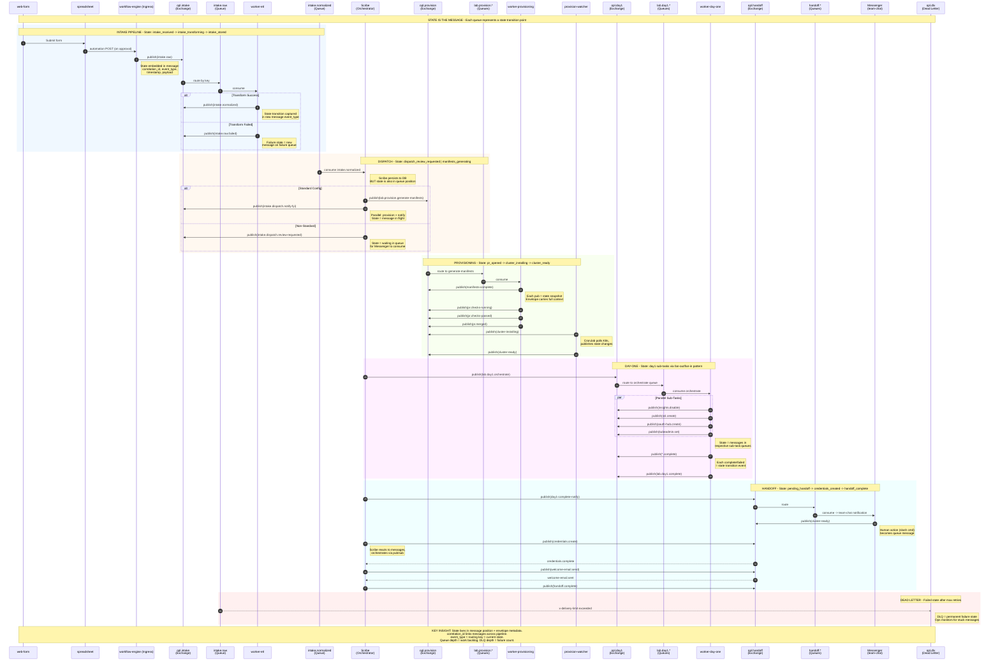

# State Capture via Exchanges/Queues

This document explains how the OpenShift Partner Labs system captures workflow state using message-broker exchanges and queues rather than relying solely on database storage.

## Sequence Diagram



## How State is Captured

The system uses an **event-sourcing pattern** where messages flowing through queues represent state transitions:

### 1. Messages ARE State

Each message envelope contains the complete state context:

| Field | Purpose |
|-------|---------|
| `event_type` | Current state name (equals routing key) |
| `correlation_id` | Links all messages for one lab request |
| `timestamp` | When state transition occurred |
| `payload` | Full context for that state |

### 2. Queue Position = Workflow Progress

A message's location indicates the current workflow state:

- Message in `intake.raw` = `intake_received` state
- Message in `lab.provision.generate-manifests` = `manifests_generating` state
- Message in `handoff.credentials.create` = `handoff_initiated` state

### 3. State Transitions = Publish New Message

Moving between states means consuming from one queue and publishing to another:

```
intake.raw --consume--> worker-etl --publish--> intake.normalized
     ^                                               ^
     |                                               |
intake_received                              intake_stored
```

### 4. Fan-Out/Fan-In Pattern

Day-one tasks run in parallel using message fan-out:

1. **Fan-out**: Scribe publishes `lab.day1.orchestrate`
2. **Parallel**: worker-day-one publishes multiple sub-task messages (`insights.disable`, `ssl.create`, etc.)
3. **Fan-in**: Scribe counts `*.complete` messages to determine when all sub-tasks finish
4. **Aggregate**: Scribe publishes `lab.day1.complete` when all sub-tasks succeed

### 5. Failure State = Dead Letter Queue

After `x-delivery-limit` retries (typically 3-5), messages land in dead-letter queues:

| Source Queue Pattern | Dead Letter Routing Key |
|---------------------|------------------------|
| `intake.*` | `dlq.intake` |
| `lab.provision.*` | `dlq.provision` |
| `lab.day1.*` | `dlq.day1` |
| `handoff.*` | `dlq.handoff` |

DLQ depth = number of permanently failed operations requiring manual intervention.

## Why This Pattern

### Advantages Over Database-Only State

| Aspect | Database State | Queue-Based State |
|--------|---------------|-------------------|
| **Durability** | Single point of failure | Distributed across quorum queues |
| **Recovery** | Requires replay logic | Resume from queue position |
| **Visibility** | Query required | Queue depth = backlog |
| **Decoupling** | Tight coupling to schema | Components only know message format |
| **Scalability** | DB connection limits | Horizontal consumer scaling |

### Scribe Still Uses a Database

Scribe persists to a database for:
- **Querying**: Portal needs to list/filter labs
- **Reporting**: Historical analytics
- **Idempotency**: Deduplication via `correlation_id`

But the **authoritative workflow state** is the message flow. If Scribe crashes mid-operation:
1. Unacknowledged messages return to queues
2. On restart, Scribe consumes and resumes
3. No "stuck in limbo" states

## Observability

Queue metrics provide real-time state visibility:

| Metric | Meaning |
|--------|---------|
| Queue depth | Work backlog for that state |
| Consumer count | Processing capacity |
| Publish rate | State transition throughput |
| DLQ depth | Failure count requiring attention |
| Message age | Time spent in current state |

## Related Documentation

- [Exchange Model](exchange-model.md) - Routing topology and binding conventions
- [REFERENCE.md](../REFERENCE.md) - Queue names and message schemas
